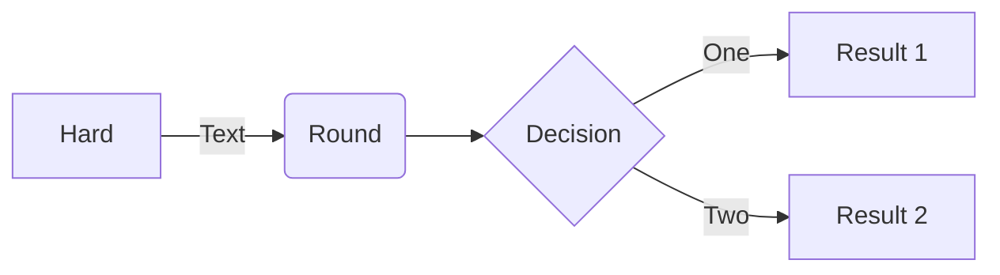

# NVIDIA F______ng drivers

En varias circunstancias, es latosa la instalación de los drivers de nvidia y la versión
correspondiente de CUDA.

En esta página se puede encontrar una lista de compatibilidades e información detallada 
adicional:
https://docs.nvidia.com/deploy/cuda-compatibility/

## Desinstalación de drivers y *software* asociado:

En ocasiones es necesario desinstalar todos los programas relacionados, estas isntrucciones
pueden ser útiles (Ubunto, debian?):

https://askubuntu.com/questions/206283/how-can-i-uninstall-a-nvidia-driver-completely

